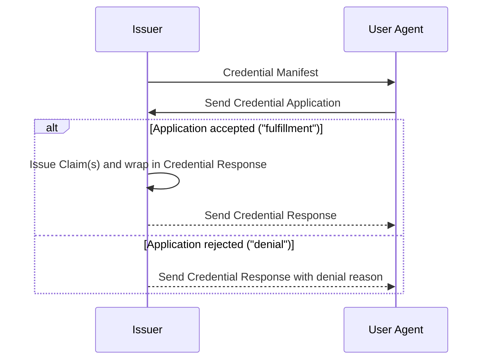

Credential Manifest 0.0.1
==================

**Specification Status:** _Strawman_

**Latest Draft:**
  [identity.foundation/credential-manifest](https://identity.foundation/credential-manifest)

**Editors:**
~ [Daniel Buchner](https://www.linkedin.com/in/dbuchner/) (Block)
~ [Brent Zundel](https://www.linkedin.com/in/bzundel/) (Avast)
~ [Jace Hensley](https://www.linkedin.com/in/jacehensley/) (Bloom)
~ [Daniel McGrogan](https://www.linkedin.com/in/dtmcgrogan/) (Workday)
~ [Gabe Cohen](https://www.linkedin.com/in/cohengabe) (Block)

<!-- -->
**Participate:**
~ [GitHub repo](https://github.com/decentralized-identity/credential-manifest)
~ [File a bug](https://github.com/decentralized-identity/credential-manifest/issues)
~ [Commit history](https://github.com/decentralized-identity/credential-manifest/commits/main)

------------------------------------

## Abstract

For User Agents (e.g. wallets) and other service that wish to engage with Issuers to acquire credentials, there must exist a mechanism for assessing what inputs are required from a Subject to process a request for credential(s) issuance. The _Credential Manifest_ is a common data format for describing the inputs a Subject must provide to an Issuer for subsequent evaluation and issuance of the credential(s) indicated in the Credential Manifest.

_Credential Manifests_ do not themselves define the contents of the output credential(s), the process the Issuer uses to evaluate the submitted inputs, or the protocol Issuers, Subjects, and their User Agents rely on to negotiate credential issuance.

## Status of This Document

Credential Manifest is a draft specification being developed within the [Decentralized Identity Foundation](https://identity.foundation) (DIF), and intended for ratification as a DIF recommended data format. This spec will be updated to reflect relevant changes, and participants are encouraged to contribute at [the following repository location](https://github.com/decentralized-identity/credential-manifest).


## Terminology

[[def:Decentralized Identifiers, Decentralized Identifier, DID]]
~ Unique ID URI string and PKI metadata document format for describing the cryptographic keys and other fundamental PKI values linked to a unique, user-controlled, self-sovereign identifier in a target system (i.e. blockchain, distributed ledger).

[[def:Claim, Claims]]
~ An assertion made about a [[ref:Subject]]. Used as an umbrella term for
Credential, Assertion, Attestation, etc.

[[def:Issuer, Issuers]]
~ Issuers are entities that issue credentials to a [[ref:Holder]].

[[def:Holder, Holders]]
~ Holders are entities that receive credentials from [[ref:Issuers]], possibly first submitting proofs to the [[ref:Issuer]] to satisfy the requirements described in a Presentation Definition. These interactions are facilitated by [[ref:User Agents]]

[[def:Output Descriptor, Output Descriptors]]
~ Output Descriptors are used by an Issuer to describe the credentials they are offering to a [[ref:Holder]]. See [Output Descriptor](#output-descriptor)

[[def:Output Descriptor Object, Output Descriptor Objects]]
~ Output Descriptor Objects are populated with properties describing the [[ref:Claims]] the [[ref:Issuer]] is offering the [[ref:Holder]]

[[def:Output Descriptor Display Object, Output Descriptor Display Objects]]
~ Output Descriptor Display Objects are populated with [DIF Data Display](https://identity.foundation/wallet-rendering/#data-display) properties

[[def:Credential Application, Credential Applications]]
~ Credential Application are objects embedded within target claim negotiation formats that pass information from the [[ref:Holder]] to the [[ref:Issuer]]. See [Credential Application](#credential-application)

[[def:Credential Response, Credential Responses]]
~ Credential Responses are objects embedded within target claim negotiation formats that enable a binary response to a [[ref:Credential Application]]. _Fulfillments_ unify the presentation of [[ref:Claims]] to a [[ref:Holder]] in accordance with the output an [[ref:Issuer]] specified in a [[ref:Credential Manifest]]. _Denials_ provide insight into why a given application did not result in a fulfillment. See [Credential Response](#credential-response).

[[def:User Agent, User Agents]]
~ User Agents are software, such as wallets or other services, acting on behalf of [[ref:Holders]], to facilitate credential acquisition and exchange. In the context of this specification, they retrieve[[ref:Credential Manifests]] and interpret them to determine issuance requirements, construct[[ref:Credential Applications]] to satisfy issuance requirements and submit them to [[ref:Issuers]], and receive and interpret [[ref:Credential Responses]].

## Overview

The following representative sequence contextualizes the top-level objects described in this specification:


This specification covers the data models and not exchange protocols; specifically:

- [[ref:User Agent]] discovery of the [[ref:Credential Manifest]] is determined by the protocol. For example, the [[ref:Issuer]] may post a QR code which, when scanned, allows a [[ref:User Agent]] to retrieve the [[ref:Credential Manifest]]
- The [[ref:Credential Response]] may be delivered in a synchronous or asynchronous manner, depending on the protocol. As an example of an asynchronous flow, the [[ref:Issuer]] may define an endpoint at which the [[ref:User Agent]] may check the issuance status and/or obtain [[ref:Credential Response]]

## Versioning

As this specification evolves, so will its object models. Future iterations of the specifications should aim to provide backwards-compatibility and minimize breaking changes. To track the evolution of this specification, all object models this specification defines ****MUST**** include a `spec_version` property, corresponding to the URI of the specification revision the object models comport with.

::: example Spec Reference
  ```json
  {
    "spec_version": "https://identity.foundation/credential-manifest/spec/v1.0.0/"
  }
  ```
:::

## Credential Manifest

_Credential Manifests_ are a resource format that defines preconditional requirements, Issuer style preferences, and other facets User Agents utilize to help articulate and select the inputs necessary for processing and issuance of a specified credential.


<section>

::: example Credential Manifest - All features exercised
```json
[[insert: ./test/credential-manifest/all_features.json]]
```
:::

</section>

### General Composition

_Credential Manifests_ are JSON objects composed as follows:

- The object ****MUST**** contain an `id` property, and it's value ****MUST****
  be a string. The string ****SHOULD**** provide a unique ID for the desired
  context. For example, a [UUID](https://www.ietf.org/rfc/rfc4122.txt) such as `32f54163-7166-48f1-93d8-f f217bdb0653`
  could provide an ID that is unique in a global context, while a simple string
  such as `my_credential_manifest_1` could be suitably unique in a local context.
- The object ****MUST**** contain a `spec_version` property, and its value ****MUST****
  be a valid spec URI according to the rules set in the [versioning section](#versioning).
- The object ****MUST**** contain an `issuer` property, and its value ****MUST**** be an object composed as follows:
    - The object ****MUST**** contain a `id` property, and its value ****MUST**** be a valid URI string that identifies who the issuer of the credential(s) will be.
    - The object ****MAY**** contain a `name` property, and its value ****MUST**** be a string that ****SHOULD**** reflect the human-readable name the Issuer wishes to be recognized by.
    - The object ****MAY**** contain a `styles` property, and its value ****MUST**** be an object or URI, as defined by the [DIF Entity Styles](https://identity.foundation/wallet-rendering/v0.0.1/#entity-styles) specification.
- The object ****MUST**** contain an `output_descriptors` property. Its value ****MUST**** be an array of Output Descriptor Objects, the composition of which are described in the [`Output Descriptor`](#output-descriptor) section below.
- The [[ref:Credential Manifest]] ****MAY**** include a `format` property. If present, its value ****MUST**** be the same structure as [Presentation Definition's `format` property](https://identity.foundation/presentation-exchange/#presentation-definition). This property informs the [[ref:Holder]] of the [[ref:Claim]] format the [[ref:Issuer]] can issuer in.
    For example:

::: example Credential Manifest Format
```json
{
  "credential_manifest": {
    "id": "WA-DL-CLASS-A",
    "output_descriptors": [],
    "format": {
      "jwt": {
        "alg": ["EdDSA", "ES256K", "ES384"]
      },
      "jwt_vc": {
        "alg": ["ES256K", "ES384"]
      },
      "jwt_vp": {
        "alg": ["EdDSA", "ES256K"]
      },
      "ldp_vc": {
        "proof_type": [
          "JsonWebSignature2020",
          "Ed25519Signature2018",
          "EcdsaSecp256k1Signature2019",
          "RsaSignature2018"
        ]
      },
      "ldp_vp": {
        "proof_type": ["Ed25519Signature2018"]
      },
      "ldp": {
        "proof_type": ["RsaSignature2018"]
      }
    }
  }
}
```
:::

- The object ****MAY**** contain a `presentation_definition` object, and its value ****MUST**** be a [Presentation Definition](https://identity.foundation/presentation-exchange/#presentation-definition) object, as defined by the [DIF Presentation Exchange](https://identity.foundation/presentation-exchange) specification.


### Output Descriptor

[[ref:Output Descriptors]] are objects used to describe the [[ref:Claims]] an [[ref:Issuer]] is offering to a [[ref:Holder]].

[[ref:Output Descriptor Objects]] contain type URI that links to the type of the offered output data, and information about how to display the output to the Holder.

<section>

::: example Output Descriptors - Simple Example
```json
[[insert: ./test/output-descriptors/simple.json]]
```
:::

</section>

#### Output Descriptor Object

[[ref:Output Descriptor Objects]] are composed as follows:

- The [[ref:Output Descriptor Object]] ****MUST**** contain an `id` property. The value of the `id` property ****MUST**** be a string that does not conflict with the `id` of another [[ref:Output Descriptor Object]] in the same [[ref:Credential Manifest]]. For example, the `id` could be a UUID or a URI.
- The [[ref:Output Descriptor Object]] ****MUST**** contain a `schema` property, and its value ****MUST**** be a string specifying the schema of the credential to be issued.
- The [[ref:Output Descriptor Object]] ****MAY**** contain a `name` property, and if present its value ****SHOULD**** be a human-friendly name that describes what the credential represents.
- The [[ref:Output Descriptor Object]] ****MAY**** contain a `description` property, and if present its value ****MUST**** be a string that describes what the credential is in greater detail.
- The [[ref:Output Descriptor Object]] ****MAY**** contain a `styles` property, and its value ****MUST**** be an object or URI, as defined by the [DIF Entity Styles](https://identity.foundation/wallet-rendering/v0.0.1/#entity-styles) specification.
- The [[ref:Output Descriptor Object]] ****MAY**** contain a `display` property, and its value ****MUST**** be an object composed as follows:
  - The [[ref:Output Descriptor Display Object]] ****MAY**** contain a `title` property and it's value ****MUST**** be an object as defined by the [DIF Display Mapping Object](https://identity.foundation/wallet-rendering/v0.0.1/#display-mapping-object.json)
  - The [[ref:Output Descriptor Display Object]] ****MAY**** contain a `subtitle` property and it's value ****MUST**** be an object as defined by the [DIF Display Mapping Object](https://identity.foundation/wallet-rendering/v0.0.1/#display-mapping-object.json)
  - The [[ref:Output Descriptor Display Object]] ****MAY**** contain a `description` property and it's value ****MUST**** be an object as defined by the [DIF Display Mapping Object](https://identity.foundation/wallet-rendering/v0.0.1/#display-mapping-object.json)
  - The [[ref:Output Descriptor Display Object]] ****MAY**** contain a `properties` property and it's value ****MUST**** be an array of objects as defined by the [DIF Labeled Display Mapping Object](https://identity.foundation/wallet-rendering/v0.0.1/#labeled-display-mapping-object.json)


#### JSON Schema

The JSON Schema Draft 7 definition that summarizes the rules above for [[ref: Output Descriptors]] [can be found after the appendix here](#output-descriptors). 

</section>

### JSON Schema

The JSON Schema Draft 7 definition that summarizes the rules above for [[ref: Credential Manifest]] [can be found after the appendix here](#credential-manifest-3). 

## Resource Location

Credential Manifests ****SHOULD**** be retrievable at known, semantic locations that are generalized across all entities, protocols, and transports. This specification does not stipulate how Credential Manifests must be located, hosted, or retrieved, but does advise that Issuers ****SHOULD**** make their Credential Manifests available via an instance of the forthcoming semantic personal data-store standard being developed by DIF, W3C, and other groups (e.g. Decentralized Web Nodes).

## Credential Application

Credential Application are objects embedded within target claim negotiation formats that pass information from the [[ref:Holder]] to the [[ref:Issuer]].

_Credential Applications_ are JSON objects composed as follows:
  - The object ****MUST**** contain an `id` property. The value of this property ****MUST**** be a unique identifier, such as a UUID.
  - The object ****MUST**** contain a `spec_version` property, and its value ****MUST**** be a valid spec URI according to the rules set in the [versioning section](#versioning).
  - The object ****MUST**** contain a `manifest_id` property. The value of this property ****MUST**** be the id of a valid Credential Manifest.
  - The ****MUST**** have a `format` property if the related [[ref:Credential Manifest]] specifies a `format` property. Its value ****MUST**** be a _subset_ of the `format` property in the [[ref:Credential Manifest]] that this [[ref:Credential Submission]] is related to. This object informs the [[ref:Issuer]] which formats the [[ref:Holder]] wants to recieve the [[ref:Claims]] in.
- The [[ref: Credential Application]] object ****MUST**** contain a `presentation_submission` property IF the related [[ref:Credential Manifest]] contains a `presentation_definition`. Its value ****MUST**** be be a valid [Presentation Submission](https://identity.foundation/presentation-exchange/#presentation-submission):

```
// NOTE: VP, OIDC, DIDComm, or CHAPI outer wrapper properties would be at outer layer
```

<section>

::: example Credential Application - Simple Example
```json
[[insert: ./test/credential-application/sample.json]]
```
:::

</section>

### Embed Targets

The following section details where the `credential_application` object is to be embedded within a target data structure.

#### Embed Locations

The following are the locations at which the _Credential Application_ object ****MUST**** be embedded for known target formats. For any location besides the top level of the embed target, the location is described in JSONPath syntax.

Target     | Location
---------- | --------
OpenID     | top-level
DIDComms   | `$.presentations~attach.data.json`
VP         | top-level
CHAPI      | `$.data`

### JSON Schema

The JSON Schema Draft 7 definition that summarizes the rules above for [[ref: Credential Application]] [can be found after the appendix here](#credential-application-3). 


## Credential Response

[[ref:Credential Responses]] are objects that encapsulate possible responses from a [[ref:Credential Application]], with two possible outcomes: _fulfillment_ or _denial_. _Fulfillment_ is the case where a [[ref:Credential Application]] is _accepted_, and results in credential issuance. Fulfillments are embedded within target [[ref:Claim]] negotiation formats that express how the outputs presented as proofs to a [[ref:Holder]] are provided in accordance with the outputs specified in a [[ref:Credential Manifest]]. _Rejection_ is the case where a [[ref:Credential Application]] is _denied_, and results in a response of pertitent information about the rejection. Embedded [[ref:Credential Response]] objects ****MUST**** be located within target data format as the value of a `credential_response` property, which is composed and embedded as follows:

- The object ****MUST**** be included at the top-level of an Embed Target, or in the specific location described in the [Embed Locations table](#embed-locations) in the [Embed Target](#embed-target) section below.
- The object ****MUST**** contain an `id` property. The value of this property ****MUST**** be a unique identifier, such as a [UUID](https://tools.ietf.org/html/rfc4122).
- The object ****MUST**** contain a `spec_version` property, and its value ****MUST**** be a valid spec URI according to the rules set in the [versioning section](#versioning).
- The object ****MUST**** contain a `manifest_id` property. The value of this property ****MUST**** be the `id` value of a valid [[ref:Credential Manifest]].
- The object ****MAY**** contain an `application_id` property. If present, the value of this property ****MUST**** be the `id` value of a valid [[ref:Credential Application]].
- The object ****MUST**** contain **one of** the following properties depending on whether the application is to be fulfilled or rejected.
  - For _fulfillment_ the object ****MUST**** contain a `fulfillment` property and its value ****MUST**** be an object composed as follows: 
    - The object ****MUST**** include a `descriptor_map` property. The value of this property ****MUST**** be an array of _Output Descriptor Mapping Objects_, just like [Presentation Submission's](https://identity.foundation/presentation-exchange/#presentation-submission) `descriptor_map` property.
  - For _denial_ the object ****MUST**** contain a `denial` property and its value ****MUST**** be an object composed as follows:
    - The object ****MUST**** contain a `reason` property . The value of this property ****MUST**** be a string which states why the [[ref:Credential Application]] was not successful.
    - The object ****MAY**** contain an `input_descriptors` property IF the related [[ref:Credential Application]] contains a `presentation_submission`. It's
    value ****MUST**** be an array of `input_descriptor` string identifiers from the `descriptor_map` property of a [Presentation Submission](https://identity.foundation/presentation-exchange/#presentation-submission) corresponding to the claims that failed to fulfill the [[ref:Credential Application]].

```
// NOTE: VP, OIDC, DIDComm, or CHAPI outer wrapper properties would be at outer layer
```

<tab-panels selected-index="0">

<nav>
  <button type="button">Fulfillment Example</button>
  <button type="button">Denial Example</button>
</nav>

<section>

::: example Credential Response - Fulfillment Example
```json
[[insert: ./test/credential-response/sample-fulfillment.json]]
```
:::

</section>

<section>

::: example Credential Response - Denial Example
```json
[[insert: ./test/credential-response/sample-denial.json]]
```
:::

</section>

</tab-panels>

### Embed Targets

The following section details where the _Credential Response_ is to be embedded within a target data structure, as well as how to formulate the [JSONPath](https://goessner.net/articles/JsonPath/) expressions to select the [[ref:Claims]] within the target data structure.

#### Embed Locations

The following are the locations at which the `credential_response` object ****MUST**** be embedded for known target formats. For any location besides the top level of the embed target, the location is described in JSONPath syntax.

Target     | Location
---------- | --------
OpenID     | top-level
DIDComms   | `$.presentations~attach.data.json`
VP         | top-level
CHAPI      | `$.data`

### JSON Schema

The JSON Schema Draft 7 definition that summarizes the rules above for [[ref: Credential Response]] [can be found after the appendix here](#credential-response-3). 

## Appendix

### Embed Target Examples

#### Credential Response

<tab-panels selected-index="0">

<nav>
  <button type="button">Verifiable Presentation</button>
</nav>

<section>

::: example Credential Response - Verifiable Presentation
```json
[[insert: ./test/credential-response/appendix.json]]
```
:::

</section>

#### Credential Application

<tab-panels selected-index="0">

<nav>
  <button type="button">Verifiable Presentation</button>
</nav>

<section>

::: example Credential Application - Verifiable Presentation
```json
[[insert: ./test/credential-application/appendix.json]]
```
:::

</section>

## JSON Schemas

### Vocabulary Definition

The _Wallet Rendering_ specification adopts and defines the following JSON
Schema data format and processing variant, which implementers ****MUST****
support for evaluation of the portions of the _Wallet Rendering_
specification that call for JSON Schema validation:
https://tools.ietf.org/html/draft-handrews-json-schema-02

### Credential Manifest

::: example Credential Manifest - Schema
```json
[[insert: ./schemas/credential-manifest.json]]
```
:::

### Output Descriptors

::: example Output Descriptors - Schema
```json
[[insert: ./schemas/output-descriptors.json]]
```
:::

### Credential Application

::: example Credential Application - Schema
```json
[[insert: ./schemas/credential-application.json]]
```
:::

### Credential Response

::: example Credential Response - Schema
```json
[[insert: ./schemas/credential-response.json]]
```
:::

## Use Cases

### Credential Issuance Discovery

As an Issuer, I want to provide a list of credentials I offer, for wallets and other entities to find and digest.

### Credential Requirement Discovery

As an Issuer, I want to provide a description of the information that a Holder would need to submit to acquire a given credential.

### Credential Display

As a Wallet Implementer, I want to know how to display a credential to the user.

As a Holder, I want my wallet to be able to display the credential in UI before I apply for it and after it is issued to me:
- Before applying for a credential:
  - Show the user examples of information contained in the VC.
  - Include the type of credential, how long it's valid for, etc.
- After taking possession of a credential:
  - Display information from the VC that is pertinent to the user.
  - Provide a way to show Issuer branding and other differentiating UI features.

As a Wallet Implementer, I want to display formatted data values.

## References

[[spec]]
