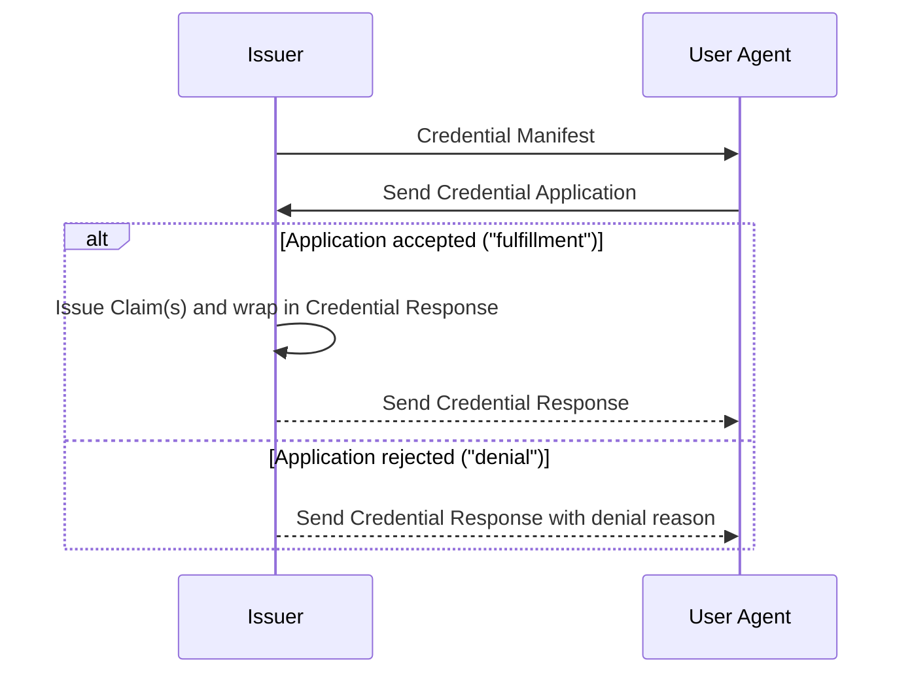

Credential Manifest 1.0.0 Working-Group Draft
==================

**Specification Status:** _Working-Group Approved Draft_

**Latest Editor's Draft:**
  [identity.foundation/credential-manifest](https://identity.foundation/credential-manifest)

**Stable Working-Group Approved Draft:**
  [identity.foundation/credential-manifest/v1.0.0](https://identity.foundation/credential-manifest/v1.0.0)


**Editors:**
~ [Daniel Buchner](https://www.linkedin.com/in/dbuchner/) (Block)
~ [Brent Zundel](https://www.linkedin.com/in/bzundel/) (Avast)
~ [Jace Hensley](https://www.linkedin.com/in/jacehensley/) (Bloom)
~ [Daniel McGrogan](https://www.linkedin.com/in/dtmcgrogan/) (Workday)
~ [Gabe Cohen](https://www.linkedin.com/in/cohengabe) (Block)
~ [Kim Hamilton Duffy](https://www.linkedin.com/in/kimdhamilton/) (Centre Consortium)

<!-- -->
**Participate:**
~ [GitHub repo](https://github.com/decentralized-identity/credential-manifest)
~ [File a bug](https://github.com/decentralized-identity/credential-manifest/issues)
~ [Commit history](https://github.com/decentralized-identity/credential-manifest/commits/main)

------------------------------------

## Abstract

For User Agents (e.g. wallets) and other service that wish to engage with
Issuers to acquire credentials, there must exist a mechanism for negotiating
(via services and interfaces that are out of scope) what inputs are required
from a Subject to process a request for credential(s) issuance. The _Credential
Manifest_ is a common data format for describing the inputs a Subject must
provide to an Issuer for subsequent evaluation and issuance of the credential(s)
indicated in the Credential Manifest, i.e. for a Subject to become a Holder.

_Credential Manifests_ do not themselves define the contents of the output
credential(s), the process the Issuer uses to evaluate the submitted inputs, or
the protocol Issuers, Subjects, and their User Agents rely on to negotiate
credential issuance. Instead, Credential Manifests are a data model for issuers
to publish and/or send individually to would-be holders, allowing the software
of the latter to understand and negotiate an issuance process.

## Status of This Document

Credential Manifest is a draft specification being developed within the
[Decentralized Identity Foundation](https://identity.foundation) (DIF). Design
work on the Credential Manifest data model is ongoing, and participants are
encouraged to open issues or otherwise contribute at [the DIF-hosted github
repository](https://github.com/decentralized-identity/credential-manifest),
whether as input to stable versions or as recommendations for future versions.


## Terminology

[[def:Decentralized Identifiers, Decentralized Identifier, DID]] 
~ Unique ID URI string and PKI metadata document format for describing the
cryptographic keys and other fundamental PKI values linked to a unique,
user-controlled, self-sovereign identifier in a target system (i.e. blockchain,
distributed ledger).

[[def:Claim, Claims]]
~ An assertion made about a [[ref:Subject]]. Used as an umbrella term for
Credential, Assertion, Attestation, etc.

[[def:Issuer, Issuers]]
~ Issuers are entities that issue credentials to a [[ref:Holder]].

[[def:Holder, Holders]] 
~ Holders are entities that receive credentials from [[ref:Issuers]], possibly
first submitting proofs to the [[ref:Issuer]] to satisfy the requirements
described in a [[ref:Presentation Definition]]. These interactions are
facilitated by [[ref:User Agents]].

[[def:Credential Manifest]] 
~ A Credential Manifest is a document, hosted by an [[ref:Issuer]] and consumed
by [[User Agents]], codifying the credentials that it issues in terms of
pre-requisites and inputs. These can be static or dynamic, but their form and
usage are detailed in this specification.

[[def:Presentation Definition, Presentation Submission, Presentation Request]] 
~ [[ref:Presentation Exchange]] is a specification codifying a _Presentation
Definition_ data format _Verifiers_ can use to articulate proof requirements in
a _Presentation Request_, and a _Presentation Submission_ data format
[[ref:Holders]] can use to describe proofs submitted in accordance with them.

[[def:Output Descriptor, Output Descriptors]] 
~ Output Descriptors are used by an Issuer to describe the credentials they are
offering to a [[ref:Holder]]. See [Output Descriptor](#output-descriptor)

[[def:Output Descriptor Object, Output Descriptor Objects]] 
~ Output Descriptor Objects are populated with properties describing the
[[ref:Claims]] the [[ref:Issuer]] is offering the [[ref:Holder]]

[[def:Output Descriptor Display Object, Output Descriptor Display Objects]] 
~ Output Descriptor Display Objects are populated with [Data
Display](https://identity.foundation/wallet-rendering/#data-display) properties
from the [[ref: Wallet Rendering]] specification.

[[def:Credential Application, Credential Applications]] 
~ Credential Application are objects embedded within target claim negotiation
formats that pass information from the [[ref:Holder]] to the [[ref:Issuer]]. See
[Credential Application](#credential-application)

[[def:Credential Response, Credential Responses]] 
~ Credential Responses are objects embedded within target claim negotiation
formats that enable a binary response to a [[ref:Credential Application]].
_Fulfillments_ unify the presentation of [[ref:Claims]] to a [[ref:Holder]] in
accordance with the output an [[ref:Issuer]] specified in a [[ref:Credential
Manifest]]. _Denials_ provide insight into why a given application did not
result in a fulfillment. See [Credential Response](#credential-response).

[[def:User Agent, User Agents]] 
~ User Agents are software, such as wallets or other services, acting on behalf
of [[ref:Holders]], to facilitate credential acquisition and exchange. In the
context of this specification, they retrieve [[ref:Credential Manifests]] and
interpret them to determine issuance requirements, construct [[ref:Credential
Applications]] to satisfy issuance requirements and submit them to
[[ref:Issuers]], and receive and interpret [[ref:Credential Responses]].

## Overview

The following representative sequence contextualizes the top-level objects
described in this specification:


This specification covers only the data models of these objects and not the
exchange protocols or architectural assumptions about how they get transported.
Specifically:

- [[ref:User Agent]] discovery of the [[ref:Credential Manifest]] is determined
  by the protocol. For example, the [[ref:Issuer]] may post a QR code which,
  when scanned, allows a [[ref:User Agent]] to retrieve the [[ref:Credential
  Manifest]]
- The [[ref:Credential Response]] may be delivered in a synchronous or
  asynchronous manner, depending on the protocol. As an example of an
  asynchronous flow, the [[ref:Issuer]] may define an endpoint at which the
  [[ref:User Agent]] may check the issuance status and/or obtain
  [[ref:Credential Response]]

## Versioning

As this specification evolves, so will its object models. Future iterations of
the specifications should aim to provide backwards-compatibility and minimize
breaking changes. To track the evolution of this specification, all object
models this specification defines ****MUST**** include a `spec_version`
property, corresponding to the URI of the specification revision the object
models conform to.

::: example Spec Reference
  ```json
  {
    "spec_version": "https://identity.foundation/credential-manifest/spec/v1.0.0/"
  }
  ```
:::

## Credential Manifest

_Credential Manifests_ are a resource format that defines preconditional
requirements, Issuer style preferences, and other facets User Agents utilize to
help articulate and select the inputs necessary for processing and issuance of a
specified credential.


<section>

::: example Credential Manifest - All features exercised
```json
[[insert: ./test/credential-manifest/all_features.json]]
```
:::

</section>

### General Composition

_Credential Manifests_ are JSON objects composed as follows:

- The object ****MUST**** contain an `id` property, and it's value ****MUST****
  be a string. The string ****SHOULD**** provide a unique ID for the desired
  context. For example, a [UUID](https://www.ietf.org/rfc/rfc4122.txt) such as
  `32f54163-7166-48f1-93d8-f f217bdb0653` could provide an ID that is unique in
  a global context, while a simple string such as `my_credential_manifest_1`
  could be suitably unique in a local context.
- The object ****MAY**** contain a `name` property, and its value ****MUST****
  be a string that acts as a summarizing title for the Manifest in question.
- The object ****MAY**** contain a `description` property, and its value ****MUST****
  be a string that explains what the Manifest in question is generally offering in 
  exchange for meeting its requirements.
- The object ****MUST**** contain a `spec_version` property, and its value ****MUST****
  be a valid spec URI according to the rules set in the [versioning section](#versioning).
- The object ****MUST**** contain an `issuer` property, and its value
  ****MUST**** be an object composed as follows:
    - The object ****MUST**** contain a `id` property, and its value
      ****MUST**** be a valid URI string that identifies who the issuer of the
      credential(s) will be.
    - The object ****MAY**** contain a `name` property, and its value
      ****MUST**** be a string that ****SHOULD**** reflect the human-readable
      name the Issuer wishes to be recognized by.
    - The object ****MAY**** contain a `styles` property, and its value
      ****MUST**** be an object or URI, as defined by the [DIF Entity
      Styles](https://identity.foundation/wallet-rendering/v0.0.1/#entity-styles)
      specification.
- The object ****MUST**** contain an `output_descriptors` property. Its value
  ****MUST**** be an array of Output Descriptor Objects, the composition of
  which are described in the [`Output Descriptor`](#output-descriptor) section
  below.
- The [[ref:Credential Manifest]] ****MAY**** include a `format` property. If
    present, its value ****MUST**** be the same structure as [Presentation
    Definition's `format`
    property](https://identity.foundation/presentation-exchange/#presentation-definition).
    This property informs the [[ref:Holder]] of the [[ref:Claim]] format the
    [[ref:Issuer]] can issuer in. For example:

::: example Credential Manifest Format
```json
{
  "credential_manifest": {
    "id": "WA-DL-CLASS-A",
    "name": "Washington State Class A Driver's License Application",
    "description": "This application is for the Washington State Class A Driver's License, which requires an applicant to be of at least 18 years of age and provide proof of CDL training completion.",
    "output_descriptors": [],
    "spec_version": "https://identity.foundation/credential-manifest/spec/v1.0.0/",
    "issuer": {
      "id": "did:example:123?linked-domains=3",
      "name": "Washington State Government",
      "styles": {
        "thumbnail": {
          "uri": "https://dol.wa.com/logo.png",
          "alt": "Washington State Seal"
        },
        "hero": {
          "uri": "https://dol.wa.com/people-working.png",
          "alt": "People working on serious things"
        },
        "background": {
          "color": "#ff0000"
        },
        "text": {
          "color": "#d4d400"
        }
      }
    },
    "format": {
      "jwt": {
        "alg": ["EdDSA", "ES256K", "ES384"]
      },
      "jwt_vc": {
        "alg": ["ES256K", "ES384"]
      },
      "jwt_vp": {
        "alg": ["EdDSA", "ES256K"]
      },
      "ldp_vc": {
        "proof_type": [
          "JsonWebSignature2020",
          "Ed25519Signature2018",
          "EcdsaSecp256k1Signature2019",
          "RsaSignature2018"
        ]
      },
      "ldp_vp": {
        "proof_type": ["Ed25519Signature2018"]
      },
      "ldp": {
        "proof_type": ["RsaSignature2018"]
      }
    }
  }
}
```
:::

- The object ****MAY**** contain a `presentation_definition` object, and its
  value ****MUST**** be a [Presentation
  Definition](https://identity.foundation/presentation-exchange/#presentation-definition)
  object, as defined by the [[ref:Presentation Exchange]] specification.


### Output Descriptor

[[ref:Output Descriptors]] are objects used to describe the [[ref:Claims]] an
[[ref:Issuer]] is offering to a [[ref:Holder]].

[[ref:Output Descriptor Objects]] contain type URI that links to the type of the
offered output data, and information about how to display the output to the
Holder.

<section>

::: example Output Descriptors - Simple Example
```json
[[insert: ./test/output-descriptors/simple.json]]
```
:::

</section>

#### Output Descriptor Object

[[ref:Output Descriptor Objects]] are composed as follows:

- The [[ref:Output Descriptor Object]] ****MUST**** contain an `id` property.
  The value of the `id` property ****MUST**** be a string that does not conflict
  with the `id` of another [[ref:Output Descriptor Object]] in the same
  [[ref:Credential Manifest]]. For example, the `id` could be a UUID or a URI.
- The [[ref:Output Descriptor Object]] ****MUST**** contain a `schema` property,
  and its value ****MUST**** be a string specifying the schema of the credential
  to be issued.
- The [[ref:Output Descriptor Object]] ****MAY**** contain a `name` property,
  and if present its value ****SHOULD**** be a human-friendly name that
  describes what the credential represents.
- The [[ref:Output Descriptor Object]] ****MAY**** contain a `description`
  property, and if present its value ****MUST**** be a string that describes
  what the credential is in greater detail.
- The [[ref:Output Descriptor Object]] ****MAY**** contain a `styles` property,
  and its value ****MUST**** be an object or URI string, whose content is
  adherent to the [Entity
  Styles](https://identity.foundation/wallet-rendering/v0.0.1/#entity-styles)
  JSON objects defined in the [DIF Wallet
  Rendering](https://identity.foundation/wallet-rendering/v0.0.1) specification.
- The [[ref:Output Descriptor Object]] ****MAY**** contain a `display` property,
  and its value ****MUST****be an object or URI string, whose content is
  adherent to the [Display
  Mapping](https://identity.foundation/wallet-rendering/v0.0.1/#display-mapping-object)
  JSON objects defined in the [DIF Wallet
  Rendering](https://identity.foundation/wallet-rendering/v0.0.1) specification.


#### JSON Schema

The [[ref:JSON Schema]] Draft 7 definition that summarizes the rules above for
[[ref: Output Descriptors]] [can be found after the appendix
here](#output-descriptors). 

</section>

### JSON Schema

The [[ref:JSON Schema]] Draft 7 definition that summarizes the rules above for
[[ref: Credential Manifest]] [can be found after the appendix
here](#credential-manifest-3). 

## Resource Location

Credential Manifests ****SHOULD**** be retrievable at known, semantic locations
that are generalized across all entities, protocols, and transports. This
specification does not stipulate how Credential Manifests must be located,
hosted, or retrieved, but does advise that Issuers ****SHOULD**** make their
Credential Manifests available via an instance of the forthcoming semantic
personal data-store standard being developed by DIF, W3C, and other groups (e.g.
Decentralized Web Nodes).

## Credential Application

Credential Application are objects embedded within target claim negotiation
formats that pass information from the [[ref:Holder]] to the [[ref:Issuer]].

_Credential Applications_ are JSON objects composed as follows:
  - The object ****MUST**** contain an `id` property. The value of this property
    ****MUST**** be a unique identifier, such as a UUID.
  - The object ****MUST**** contain a `spec_version` property, and its value
    ****MUST**** be a valid spec URI according to the rules set in the
    [versioning section](#versioning).
  - The object ****MUST**** contain a `manifest_id` property. The value of this
    property ****MUST**** be the id of a valid Credential Manifest.
  - The object ****MUST**** have a `format` property if the related
    [[ref:Credential Manifest]] specifies a `format` property. Its value
    ****MUST**** be a _subset_ of the `format` property in the [[ref:Credential
    Manifest]] that this [[ref:Credential Submission]] is related to. This
    object informs the [[ref:Issuer]] which formats the [[ref:Holder]] wants to
    receive the [[ref:Claims]] in.
- The [[ref: Credential Application]] object ****MUST**** contain a
  `presentation_submission` property IF the related [[ref:Credential Manifest]]
  contains a `presentation_definition`. Its value ****MUST**** be a valid
  [Presentation
  Submission](https://identity.foundation/presentation-exchange/#presentation-submission)
  as defined in the [[ref:Presentation Exchange]] specification:

::: note
VP, OIDC, DIDComm, or CHAPI outer wrapper properties would be at outer layer
:::

<section>

::: example Credential Application - Simple Example
```json
[[insert: ./test/credential-application/sample.json]]
```
:::

</section>

### Embed Targets

The following section details where the `credential_application` object is to be
embedded within a target data structure.

#### Embed Locations

The following are the locations at which the _Credential Application_ object
****MUST**** be embedded for known target formats. For any location besides the
top level of the embed target, the location is described in JSONPath syntax.

Target     | Location
---------- | --------
OpenID     | top-level
DIDComms   | `$.presentations~attach.data.json`
VP         | top-level
CHAPI      | `$.data`

### JSON Schema

The [[ref:JSON Schema]] Draft 7 definition that summarizes the rules above for
[[ref: Credential Application]] [can be found after the appendix
here](#credential-application-3). 


## Credential Response

[[ref:Credential Responses]] are objects that encapsulate possible responses
from a [[ref:Credential Application]], with two possible outcomes: _fulfillment_
or _denial_. _Fulfillment_ is the case where a [[ref:Credential Application]] is
_accepted_, and results in credential issuance. Fulfillments are embedded within
target [[ref:Claim]] negotiation formats that express how the outputs presented
as proofs to a [[ref:Holder]] are provided in accordance with the outputs
specified in a [[ref:Credential Manifest]]. _Rejection_ is the case where a
[[ref:Credential Application]] is _denied_, and results in a response of
pertitent information about the rejection. Embedded [[ref:Credential Response]]
objects ****MUST**** be located within target data format as the value of a
`credential_response` property, which is composed and embedded as follows:

- The object ****MUST**** be included at the top-level of an Embed Target, or in
  the specific location described in the [Embed Locations
  table](#embed-locations) in the [Embed Target](#embed-target) section below.
- The object ****MUST**** contain an `id` property. The value of this property
  ****MUST**** be a unique identifier, such as a
  [UUID](https://tools.ietf.org/html/rfc4122).
- The object ****MUST**** contain a `spec_version` property, and its value
  ****MUST**** be a valid spec URI according to the rules set in the [versioning
  section](#versioning).
- The object ****MUST**** contain a `manifest_id` property. The value of this
  property ****MUST**** be the `id` value of a valid [[ref:Credential
  Manifest]].
- The object ****MAY**** contain an `application_id` property. If present, the
  value of this property ****MUST**** be the `id` value of a valid
  [[ref:Credential Application]].
- The object ****MUST**** contain **one of** the following properties depending
  on whether the application is to be fulfilled or rejected.
  - For _fulfillment_ the object ****MUST**** contain a `fulfillment` property
    and its value ****MUST**** be an object composed as follows: 
    - The object ****MUST**** include a `descriptor_map` property. The value of
      this property ****MUST**** be an array of _Output Descriptor Mapping
      Objects_, just like [Presentation
      Submission's](https://identity.foundation/presentation-exchange/#presentation-submission)
      `descriptor_map` property as defined in the [[ref:Presentation Exchange]]
      specification.
  - For _denial_ the object ****MUST**** contain a `denial` property and its
    value ****MUST**** be an object composed as follows:
    - The object ****MUST**** contain a `reason` property . The value of this
      property ****MUST**** be a string which states why the [[ref:Credential
      Application]] was not successful.
    - The object ****MAY**** contain an `input_descriptors` property IF the
    related [[ref:Credential Application]] contains a `presentation_submission`.
    It's value ****MUST**** be an array of `input_descriptor` string identifiers
    from the `descriptor_map` property of a [Presentation
    Submission](https://identity.foundation/presentation-exchange/#presentation-submission),
    as defined in the [[ref:Presentation Exchange]] specification, corresponding
    to the claims that failed to fulfill the [[ref:Credential Application]].

```
// NOTE: VP, OIDC, DIDComm, or CHAPI outer wrapper properties would be at outer layer
```

<tab-panels selected-index="0">

<nav>
  <button type="button">Fulfillment Example</button>
  <button type="button">Denial Example</button>
</nav>

<section>

::: example Credential Response - Fulfillment Example
```json
[[insert: ./test/credential-response/sample-fulfillment.json]]
```
:::

</section>

<section>

::: example Credential Response - Denial Example
```json
[[insert: ./test/credential-response/sample-denial.json]]
```
:::

</section>

</tab-panels>

### Embed Targets

The following section details where the _Credential Response_ is to be embedded
within a target data structure, as well as how to formulate the
[JSONPath](https://goessner.net/articles/JsonPath/) expressions to select the
[[ref:Claims]] within the target data structure.

#### Embed Locations

The following are the locations at which the `credential_response` object
****MUST**** be embedded for known target formats. For any location besides the
top level of the embed target, the location is described in JSONPath syntax.

Target     | Location
---------- | --------
OpenID     | top-level
DIDComms   | `$.presentations~attach.data.json`
VP         | top-level
CHAPI      | `$.data`

### JSON Schema

The [[ref:JSON Schema]] Draft 7 definition that summarizes the rules above for
[[ref: Credential Response]] [can be found after the appendix
here](#credential-response-3). 

## Input Evaluation

Input is evaluated from two perspectives: that of the [[ref:Issuer]], who
creates a [[ref:Credential Manifest]] and from that of the [[ref:User Agent]],
who responds to a Manifest with a [[ref:Credential Application]].

A [[ref:User Agent]] first processes a [[ref:Credential Manifest]] in order to
generate a valid [[ref:Credential Application]]. If a 
[[ref:Credential Manifest]] includes a `presentation_definition` property, the
[[ref:User Agent]] ****MUST**** include a valid [Presentation
Submission](https://identity.foundation/presentation-exchange/#presentation-submission)
in the  `presentation_submission` property of its corresponding [[ref:Credential
Application]].

An [[ref:Issuer] upon receiving a [[ref:Credential Application]] ****MUST****
evaluate the input against the associated [[ref:Credential Manifest]]. If the
[[ref:Credential Application]] contains a 
[Presentation Submission](https://identity.foundation/presentation-exchange/#presentation-submission),
it ****MUST**** be processed as specified in [Presentation Exchange: Input
Evaluation](https://identity.foundation/presentation-exchange/#input-evaluation).

## Appendix

### Embed Target Examples

#### Credential Manifest

<tab-panels selected-index="0">

<nav>
  <button type="button">JWT</button>
</nav>

<section>

::: example Credential Manifest - JWT
```text
eyJhbGciOiJFZERTQSIsImtpZCI6ImRpZDpleGFtcGxlOmViZmViMWY3MTJlYmM2ZjFjMjc2ZTEyZWMyMSIsInR5cCI6IkpXVCJ9.eyJjcmVkZW50aWFsX21hbmlmZXN0Ijp7ImZvcm1hdCI6eyJqd3RfdmMiOnsiYWxnIjpbIkVkRFNBIl19fSwiaWQiOiIzMmY1NDE2My03MTY2LTQ4ZjEtOTNkOC1mZjIxN2JkYjA2NTMiLCJpc3N1ZXIiOnsiaWQiOiJkaWQ6ZXhhbXBsZTplYmZlYjFmNzEyZWJjNmYxYzI3NmUxMmVjMjEifSwib3V0cHV0X2Rlc2NyaXB0b3JzIjpbeyJkZXNjcmlwdGlvbiI6ImRyaXZlcnMgbGljZW5zZSBjcmVkZW50aWFsIiwiaWQiOiJkcml2ZXJzX2xpY2Vuc2UiLCJzY2hlbWEiOiJodHRwczovL2V1LmNvbS9jbGFpbXMvRHJpdmVyc0xpY2Vuc2UifSx7ImRlc2NyaXB0aW9uIjoiZW1wbG95bWVudCBoaXN0b3J5IGNyZWRlbnRpYWwiLCJpZCI6ImVtcGxveW1lbnRfaGlzdG9yeSIsInNjaGVtYSI6Imh0dHBzOi8vYnVzaW5lc3Mtc3RhbmRhcmRzLm9yZy9zY2hlbWFzL2VtcGxveW1lbnQtaGlzdG9yeS5qc29uIn1dLCJwcmVzZW50YXRpb25fZGVmaW5pdGlvbiI6eyJpZCI6ImZmMjE3YmRiMDY1My0zMmY1NDE2My03MTY2LTQ4ZjEtOTNkOCIsImlucHV0X2Rlc2NyaXB0b3JzIjpbeyJjb25zdHJhaW50cyI6eyJmaWVsZHMiOlt7ImlkIjoibGljZW5zZV9zY2hlbWEiLCJwYXRoIjpbIiQuY3JlZGVudGlhbFNjaGVtYS5pZCJdfSx7ImlkIjoibGljZW5zZV9udW1iZXIiLCJwYXRoIjpbIiQuY3JlZGVudGlhbFN1YmplY3QubGljZW5zZU51bWJlciJdfSx7ImlkIjoibGljZW5zZV9zdGF0ZSIsInBhdGgiOlsiJC5jcmVkZW50aWFsU3ViamVjdC5saWNlbnNlU3RhdGUiXX1dfSwiaWQiOiJsaWNlbnNlX2lucHV0In0seyJjb25zdHJhaW50cyI6eyJmaWVsZHMiOlt7ImlkIjoiZW1wbG95bWVudF9zY2hlbWEiLCJwYXRoIjpbIiQuY3JlZGVudGlhbFNjaGVtYS5pZCJdfSx7ImlkIjoiZW1wbG95ZXJfbmFtZSIsInBhdGgiOlsiJC5jcmVkZW50aWFsU3ViamVjdC5lbXBsb3llck5hbWUiXX1dfSwiaWQiOiJlbXBsb3ltZW50X2lucHV0In1dLCJuYW1lIjoiUmVxdWlyZW1lbnRzIGZvciBhIG5ldyBsaWNlbnNlIGFuZCBlbXBsb3ltZW50IGhpc3RvcnkifSwic3BlY192ZXJzaW9uIjoiaHR0cHM6Ly9pZGVudGl0eS5mb3VuZGF0aW9uL2NyZWRlbnRpYWwtbWFuaWZlc3Qvc3BlYy92MS4wLjAvIn0sImlhdCI6MTY2NzUzMTc5NiwiaXNzIjoiZGlkOmV4YW1wbGU6ZWJmZWIxZjcxMmViYzZmMWMyNzZlMTJlYzIxIn0.PCrXyRHOglEBpDPcqCkNo8BSURcEVVgp0ukJGHzvhjeTTYHXB0V5Fu-G6jLx1JVMXcXHlwaDTXitxpnc9ULBBg
```
:::

::: example Credential Manifest - JWT decoded
```json
[[insert: ./test/credential-manifest/appendix-jwt.json]]
```
:::

</section>

#### Credential Application

<tab-panels selected-index="0">

<nav>
  <button type="button">Verifiable Presentation</button>
  <button type="button">JWT</button>
</nav>

<section>

::: example Credential Application - Verifiable Presentation
```json
[[insert: ./test/credential-application/appendix.json]]
```
:::

</section>

<section>

::: example Credential Application - JWT
```text
eyJhbGciOiJFZERTQSIsImtpZCI6ImRpZDpleGFtcGxlOmViZmViMWY3MTJlYmM2ZjFjMjc2ZTEyZWMyMSIsInR5cCI6IkpXVCJ9.eyJjcmVkZW50aWFsX2FwcGxpY2F0aW9uIjp7ImZvcm1hdCI6eyJqd3RfdmMiOnsiYWxnIjpbIkVkRFNBIl19fSwiaWQiOiI5YjFkZWI0ZC0zYjdkLTRiYWQtOWJkZC0yYjBkN2IzZGNiNmQiLCJtYW5pZmVzdF9pZCI6IldBLURMLUNMQVNTLUEiLCJwcmVzZW50YXRpb25fc3VibWlzc2lvbiI6eyJkZWZpbml0aW9uX2lkIjoiMzJmNTQxNjMtNzE2Ni00OGYxLTkzZDgtZmYyMTdiZGIwNjUzIiwiZGVzY3JpcHRvcl9tYXAiOlt7ImZvcm1hdCI6Imp3dF92YyIsImlkIjoiaW5wdXRfMSIsInBhdGgiOiIkLnZlcmlmaWFibGVDcmVkZW50aWFsWzBdIn0seyJmb3JtYXQiOiJqd3RfdmMiLCJpZCI6ImlucHV0XzIiLCJwYXRoIjoiJC52ZXJpZmlhYmxlQ3JlZGVudGlhbFsxXSJ9XSwiaWQiOiJhMzBlM2I5MS1mYjc3LTRkMjItOTVmYS04NzE2ODljMzIyZTIifSwic3BlY192ZXJzaW9uIjoiaHR0cHM6Ly9pZGVudGl0eS5mb3VuZGF0aW9uL2NyZWRlbnRpYWwtbWFuaWZlc3Qvc3BlYy92MS4wLjAvIn0sImlhdCI6MTY2NzUzMzEzOCwiaXNzIjoiZGlkOmV4YW1wbGU6ZWJmZWIxZjcxMmViYzZmMWMyNzZlMTJlYzIxIiwidmVyaWZpYWJsZUNyZWRlbnRpYWxzIjpbImV5SmhiR2NpT2lKRlpFUlRRU0lzSW10cFpDSTZJbVJwWkRwbGVHRnRjR3hsT21WaVptVmlNV1kzTVRKbFltTTJaakZqTWpjMlpURXlaV015TVNJc0luUjVjQ0k2SWtwWFZDSjkuZXlKcGMzTWlPaUprYVdRNlpYaGhiWEJzWlRveE1qTWlMQ0pxZEdraU9pSm9kSFJ3Y3pvdkwyVjFMbU52YlM5amJHRnBiWE12UkhKcGRtVnljMHhwWTJWdWMyVWlMQ0p1WW1ZaU9qRTJOamMxTXpNeE16Z3hOekF4TmpZd01EQXNJbk4xWWlJNkltUnBaRHBsZUdGdGNHeGxPbVZpWm1WaU1XWTNNVEpsWW1NMlpqRmpNamMyWlRFeVpXTXlNU0lzSW5aaklqcDdJa0JqYjI1MFpYaDBJanBiSW1oMGRIQnpPaTh2ZDNkM0xuY3pMbTl5Wnk4eU1ERTRMMk55WldSbGJuUnBZV3h6TDNZeElsMHNJbWxrSWpvaWFIUjBjSE02THk5bGRTNWpiMjB2WTJ4aGFXMXpMMFJ5YVhabGNuTk1hV05sYm5ObElpd2lkSGx3WlNJNld5SkZWVVJ5YVhabGNuTk1hV05sYm5ObElsMHNJbWx6YzNWbGNpSTZJbVJwWkRwbGVHRnRjR3hsT2pFeU15SXNJbWx6YzNWaGJtTmxSR0YwWlNJNklqSXdNVEF0TURFdE1ERlVNVGs2TnpNNk1qUmFJaXdpWTNKbFpHVnVkR2xoYkZOMVltcGxZM1FpT25zaVlXTmpiM1Z1ZEhNaU9sdDdJbWxrSWpvaU1USXpORFUyTnpnNU1DSXNJbkp2ZFhSbElqb2lSRVV0T1RnM05qVTBNekl4TUNKOUxIc2lhV1FpT2lJeU5EVTNPVEV6TlRjd0lpd2ljbTkxZEdVaU9pSkVSUzB3TnpVek1UazNOVFF5SW4xZExDSnBaQ0k2SW1ScFpEcGxlR0Z0Y0d4bE9tVmlabVZpTVdZM01USmxZbU0yWmpGak1qYzJaVEV5WldNeU1TSjlmWDAuMFpzNXBUcnNuZHdxYnJNVndTVVViTDA0dTFsUk03a25tQ2JBc2hYd1BQMWNfc1BwcW45c0Jha1BOT2RBZ0RfQVhMWFBnOEswQ1pWbDVtRmRRX2VCRFEiLCJleUpoYkdjaU9pSkZaRVJUUVNJc0ltdHBaQ0k2SW1ScFpEcGxlR0Z0Y0d4bE9tVmlabVZpTVdZM01USmxZbU0yWmpGak1qYzJaVEV5WldNeU1TSXNJblI1Y0NJNklrcFhWQ0o5LmV5SnBjM01pT2lKa2FXUTZabTl2T2pFeU15SXNJbXAwYVNJNkltaDBkSEJ6T2k4dlluVnphVzVsYzNNdGMzUmhibVJoY21SekxtOXlaeTl6WTJobGJXRnpMMlZ0Y0d4dmVXMWxiblF0YUdsemRHOXllUzVxYzI5dUlpd2libUptSWpveE5qWTNOVE16TVRNNE1UY3dNemN5TURBd0xDSnpkV0lpT2lKa2FXUTZaWGhoYlhCc1pUcGxZbVpsWWpGbU56RXlaV0pqTm1ZeFl6STNObVV4TW1Wak1qRWlMQ0oyWXlJNmV5SkFZMjl1ZEdWNGRDSTZXeUpvZEhSd2N6b3ZMM2QzZHk1M015NXZjbWN2TWpBeE9DOWpjbVZrWlc1MGFXRnNjeTkyTVNKZExDSnBaQ0k2SW1oMGRIQnpPaTh2WW5WemFXNWxjM010YzNSaGJtUmhjbVJ6TG05eVp5OXpZMmhsYldGekwyVnRjR3h2ZVcxbGJuUXRhR2x6ZEc5eWVTNXFjMjl1SWl3aWRIbHdaU0k2V3lKV1pYSnBabWxoWW14bFEzSmxaR1Z1ZEdsaGJDSXNJa2RsYm1WeWFXTkZiWEJzYjNsdFpXNTBRM0psWkdWdWRHbGhiQ0pkTENKcGMzTjFaWElpT2lKa2FXUTZabTl2T2pFeU15SXNJbWx6YzNWaGJtTmxSR0YwWlNJNklqSXdNVEF0TURFdE1ERlVNVGs2TnpNNk1qUmFJaXdpWTNKbFpHVnVkR2xoYkZOMVltcGxZM1FpT25zaVlXTjBhWFpsSWpwMGNuVmxMQ0pwWkNJNkltUnBaRHBsZUdGdGNHeGxPbVZpWm1WaU1XWTNNVEpsWW1NMlpqRmpNamMyWlRFeVpXTXlNU0o5ZlgwLlZ6U28xZjJMYUN1R2tTRGVpSVhiUXNPTmJSSV83NUxZQ05IQ1NWd09rWTA1b0dqNmtneGFnSFVXLThRaWk1QmhlV0NjQmgzRVU4allyZnFuTnRGTUFRIl19.zyfAs5yD_N5W-6WSwRABuNtKaMQA0YImiAIOBU9fKV51KA4AORlvvA_3svWAsDZFK6ZvH-fKzF70k4OYS04vBQ
```
:::

::: example Credential Application - JWT decoded
```json
[[insert: ./test/credential-application/appendix-jwt.json]]
```
:::

</section>

#### Credential Response

<tab-panels selected-index="0">

<nav>
  <button type="button">Verifiable Presentation</button>
  <button type="button">JWT</button>
</nav>

<section>

::: example Credential Response - Verifiable Presentation
```json
[[insert: ./test/credential-response/appendix.json]]
```
:::

</section>

<section>

::: example Credential Response - JWT
```text
eyJhbGciOiJFZERTQSIsImtpZCI6ImRpZDpleGFtcGxlOmViZmViMWY3MTJlYmM2ZjFjMjc2ZTEyZWMyMSIsInR5cCI6IkpXVCJ9.eyJjcmVkZW50aWFsX3Jlc3BvbnNlIjp7ImFwcGxpY2F0aW9uX2lkIjoiOWIxZGViNGQtM2I3ZC00YmFkLTliZGQtMmIwZDdiM2RjYjZkIiwiZnVsZmlsbG1lbnQiOnsiZGVzY3JpcHRvcl9tYXAiOlt7ImZvcm1hdCI6Imp3dF92YyIsImlkIjoibGljZW5zZV9vdXRwdXQiLCJwYXRoIjoiJC52ZXJpZmlhYmxlQ3JlZGVudGlhbFswXSJ9LHsiZm9ybWF0Ijoiand0X3ZjIiwiaWQiOiJlbXBsb3ltZW50X291dHB1dCIsInBhdGgiOiIkLnZlcmlmaWFibGVDcmVkZW50aWFsWzFdIn1dfSwiaWQiOiJhMzBlM2I5MS1mYjc3LTRkMjItOTVmYS04NzE2ODljMzIyZTIiLCJtYW5pZmVzdF9pZCI6IjMyZjU0MTYzLTcxNjYtNDhmMS05M2Q4LWZmMjE3YmRiMDY1MyIsInNwZWNfdmVyc2lvbiI6Imh0dHBzOi8vaWRlbnRpdHkuZm91bmRhdGlvbi9jcmVkZW50aWFsLW1hbmlmZXN0L3NwZWMvdjEuMC4wLyJ9LCJpYXQiOjE2Njc1MzM2MTUsImlzcyI6ImRpZDpleGFtcGxlOmViZmViMWY3MTJlYmM2ZjFjMjc2ZTEyZWMyMSIsInZlcmlmaWFibGVDcmVkZW50aWFscyI6WyJleUpoYkdjaU9pSkZaRVJUUVNJc0ltdHBaQ0k2SW1ScFpEcGxlR0Z0Y0d4bE9tVmlabVZpTVdZM01USmxZbU0yWmpGak1qYzJaVEV5WldNeU1TSXNJblI1Y0NJNklrcFhWQ0o5LmV5SnBjM01pT2lKa2FXUTZaWGhoYlhCc1pUb3hNak1pTENKcWRHa2lPaUpvZEhSd2N6b3ZMMlYxTG1OdmJTOWpiR0ZwYlhNdlJISnBkbVZ5YzB4cFkyVnVjMlVpTENKdVltWWlPakUyTmpjMU16TTJNVFV6TURVMk16a3dNREFzSW5OMVlpSTZJbVJwWkRwbGVHRnRjR3hsT21WaVptVmlNV1kzTVRKbFltTTJaakZqTWpjMlpURXlaV015TVNJc0luWmpJanA3SWtCamIyNTBaWGgwSWpwYkltaDBkSEJ6T2k4dmQzZDNMbmN6TG05eVp5OHlNREU0TDJOeVpXUmxiblJwWVd4ekwzWXhJbDBzSW1sa0lqb2lhSFIwY0hNNkx5OWxkUzVqYjIwdlkyeGhhVzF6TDBSeWFYWmxjbk5NYVdObGJuTmxJaXdpZEhsd1pTSTZXeUpGVlVSeWFYWmxjbk5NYVdObGJuTmxJbDBzSW1semMzVmxjaUk2SW1ScFpEcGxlR0Z0Y0d4bE9qRXlNeUlzSW1semMzVmhibU5sUkdGMFpTSTZJakl3TVRBdE1ERXRNREZVTVRrNk56TTZNalJhSWl3aVkzSmxaR1Z1ZEdsaGJGTjFZbXBsWTNRaU9uc2lZV05qYjNWdWRITWlPbHQ3SW1sa0lqb2lNVEl6TkRVMk56ZzVNQ0lzSW5KdmRYUmxJam9pUkVVdE9UZzNOalUwTXpJeE1DSjlMSHNpYVdRaU9pSXlORFUzT1RFek5UY3dJaXdpY205MWRHVWlPaUpFUlMwd056VXpNVGszTlRReUluMWRMQ0pwWkNJNkltUnBaRHBsZUdGdGNHeGxPbVZpWm1WaU1XWTNNVEpsWW1NMlpqRmpNamMyWlRFeVpXTXlNU0o5ZlgwLlJkS2E1NldDT0V2SlFxNnp0QmhEZHJDUlNtLXpYeWFBbnlWTVJsclcwV1RsdkUyMjV3OHVuZDl2U2g2V1h6cGVxQnpXemhlMzBRc3kwekd3dzZkcUNRIiwiZXlKaGJHY2lPaUpGWkVSVFFTSXNJbXRwWkNJNkltUnBaRHBsZUdGdGNHeGxPbVZpWm1WaU1XWTNNVEpsWW1NMlpqRmpNamMyWlRFeVpXTXlNU0lzSW5SNWNDSTZJa3BYVkNKOS5leUpwYzNNaU9pSmthV1E2Wm05dk9qRXlNeUlzSW1wMGFTSTZJbWgwZEhCek9pOHZZblZ6YVc1bGMzTXRjM1JoYm1SaGNtUnpMbTl5Wnk5elkyaGxiV0Z6TDJWdGNHeHZlVzFsYm5RdGFHbHpkRzl5ZVM1cWMyOXVJaXdpYm1KbUlqb3hOalkzTlRNek5qRTFNekExTnpneU1EQXdMQ0p6ZFdJaU9pSmthV1E2WlhoaGJYQnNaVHBsWW1abFlqRm1OekV5WldKak5tWXhZekkzTm1VeE1tVmpNakVpTENKMll5STZleUpBWTI5dWRHVjRkQ0k2V3lKb2RIUndjem92TDNkM2R5NTNNeTV2Y21jdk1qQXhPQzlqY21Wa1pXNTBhV0ZzY3k5Mk1TSmRMQ0pwWkNJNkltaDBkSEJ6T2k4dlluVnphVzVsYzNNdGMzUmhibVJoY21SekxtOXlaeTl6WTJobGJXRnpMMlZ0Y0d4dmVXMWxiblF0YUdsemRHOXllUzVxYzI5dUlpd2lkSGx3WlNJNld5SldaWEpwWm1saFlteGxRM0psWkdWdWRHbGhiQ0lzSWtkbGJtVnlhV05GYlhCc2IzbHRaVzUwUTNKbFpHVnVkR2xoYkNKZExDSnBjM04xWlhJaU9pSmthV1E2Wm05dk9qRXlNeUlzSW1semMzVmhibU5sUkdGMFpTSTZJakl3TVRBdE1ERXRNREZVTVRrNk56TTZNalJhSWl3aVkzSmxaR1Z1ZEdsaGJGTjFZbXBsWTNRaU9uc2lZV04wYVhabElqcDBjblZsTENKcFpDSTZJbVJwWkRwbGVHRnRjR3hsT21WaVptVmlNV1kzTVRKbFltTTJaakZqTWpjMlpURXlaV015TVNKOWZYMC4ycFNKNllKb0hlUDlNbkNDTzhiV25GelBrbEZiUFQwS05kRHR6UGd1NGRONG9paTV3MkZEOG1mblVjWnl5MDJMaTdwVjhsUTdOMG9QdHBVcXlGODVEUSJdfQ.n2k0Na7lHaAVGiJof4xB1s5Z8aUS5UIvwtqGrb1MEa6o2OMdetMCtMODlYc__EnfH8J-ADT6k5mLsnI4vlT4DQ
```
:::

::: example Credential Response - JWT decoded
```json
[[insert: ./test/credential-response/appendix-jwt.json]]
```
:::
</section>


## JSON Schemas

### Vocabulary Definition

The [[ref:Wallet Rendering]] specification adopts and defines the following
[[ref:JSON Schema]] data format and processing variant. If [[ref:Wallet
Rendering]] is used, the implementers ****MUST**** support for evaluation of the
portions of the [[ref:Wallet Rendering]] specification that call for [[ref:JSON
Schema]]
[validation](https://tools.ietf.org/html/draft-handrews-json-schema-02).

::: note
Wallet Rendering is still under development (also at DIF) and should be 
considered unstable until a stable version is released. 
:::


### Credential Manifest

::: example Credential Manifest - Schema
```json
[[insert: ./schemas/credential-manifest.json]]
```
:::

### Output Descriptors

::: example Output Descriptors - Schema
```json
[[insert: ./schemas/output-descriptors.json]]
```
:::

### Credential Application

::: example Credential Application - Schema
```json
[[insert: ./schemas/credential-application.json]]
```
:::

### Credential Response

::: example Credential Response - Schema
```json
[[insert: ./schemas/credential-response.json]]
```
:::

## Use Cases

### Credential Issuance Discovery

As an Issuer, I want to publish a list of credentials I offer, for wallets and
other entities to find and digest.

### Credential Requirement Discovery

As an Issuer, I want to provide a description of the information that a Holder
would need to submit to acquire a given credential.

### Credential Display

*Note: This set of use cases requires [[ref: Wallet Rendering]]. Wallet
Rendering is still under development (also at DIF) and should be considered
unstable until a stable version is released.* 

As a Wallet Implementer, I want to know how to display a credential to the user.

As a Holder, I want my wallet to be able to display the credential (i.e.
contents or payload) of a future verifiable credential in UI before I apply for
it and after it is issued to me:
- Before applying for a credential:
  - Show the user examples of information contained in the VC.
  - Include the type of credential, how long it's valid for, etc.
  - Generate a interactive modal, form, etc. for user-inputted fields that can
    interact with other software (such as a password manager or form-filler)
- After taking possession of a credential:
  - Display information from the VC that is pertinent to the user.
  - Provide a way to show Issuer branding and other differentiating UI features.

As a Wallet Implementer, I want to display formatted data values.

## References

[[def:Presentation Exchange]] 
~ [Presentation Exchange 2.0.0](https://identity.foundation/presentation-exchange). 
  Daniel Buchner, Brent Zundel, Martin Riedel, Kim Hamilton Duffy. 
  Status: _Working Group Draft_

[[def:Wallet Rendering]] 
~ [Wallet Rendering](https://identity.foundation/wallet-rendering/#data-display). 
  Daniel Buchner, Brent Zundel, Jace Hensley, Daniel McGrogan. 
  Status: _Strawman_

[[def:JSON Schema]] 
~ [JSON Schema: A Media Type for Describing JSON Documents](https://json-schema.org/draft/2020-12/json-schema-core.html). 
  A. Wright, H. Andrews, B. Hutton, G. Dennis. Status: 28 January 2020.
  Status: Internet-Draft. 

[[def: JSON Schema Validation]]  
  ~ [JSON Schema Validation](https://tools.ietf.org/html/draft-handrews-json-schema-02). 
  A. Wright, H. Andrews, B. Hutton. March 19, 2020. 
  Status: Internet Draft.